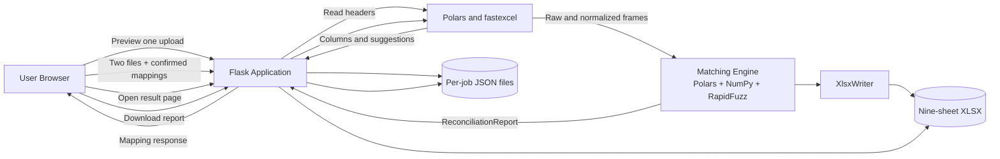
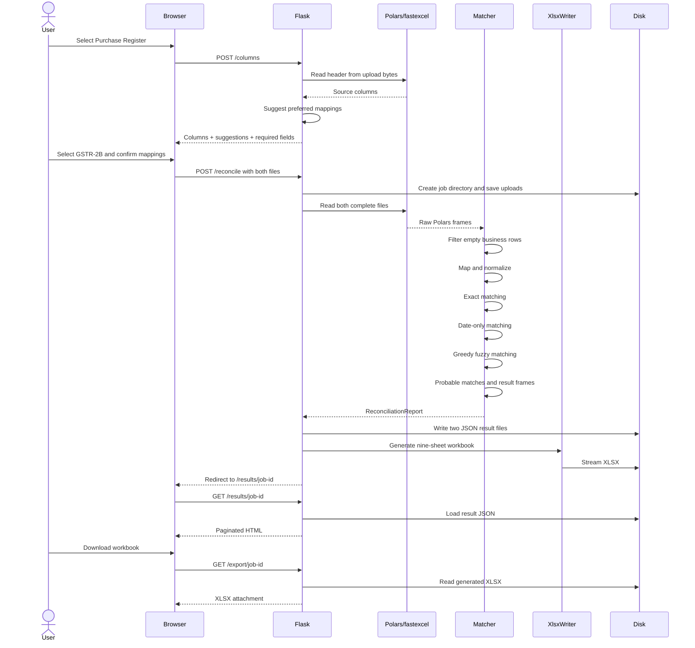
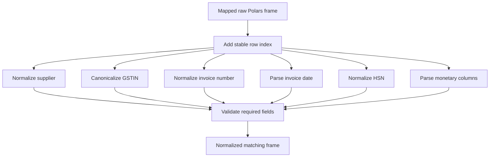
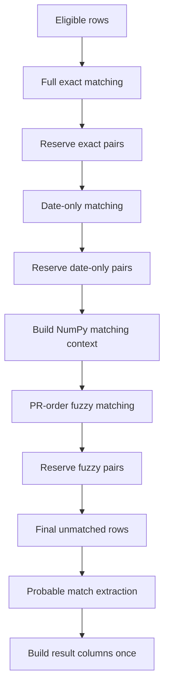
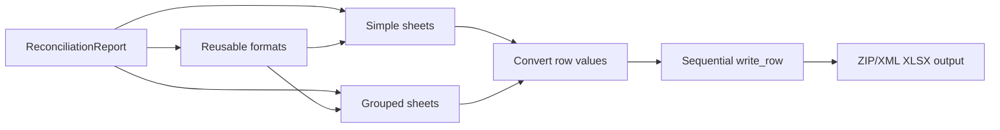
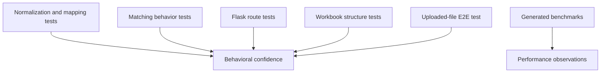
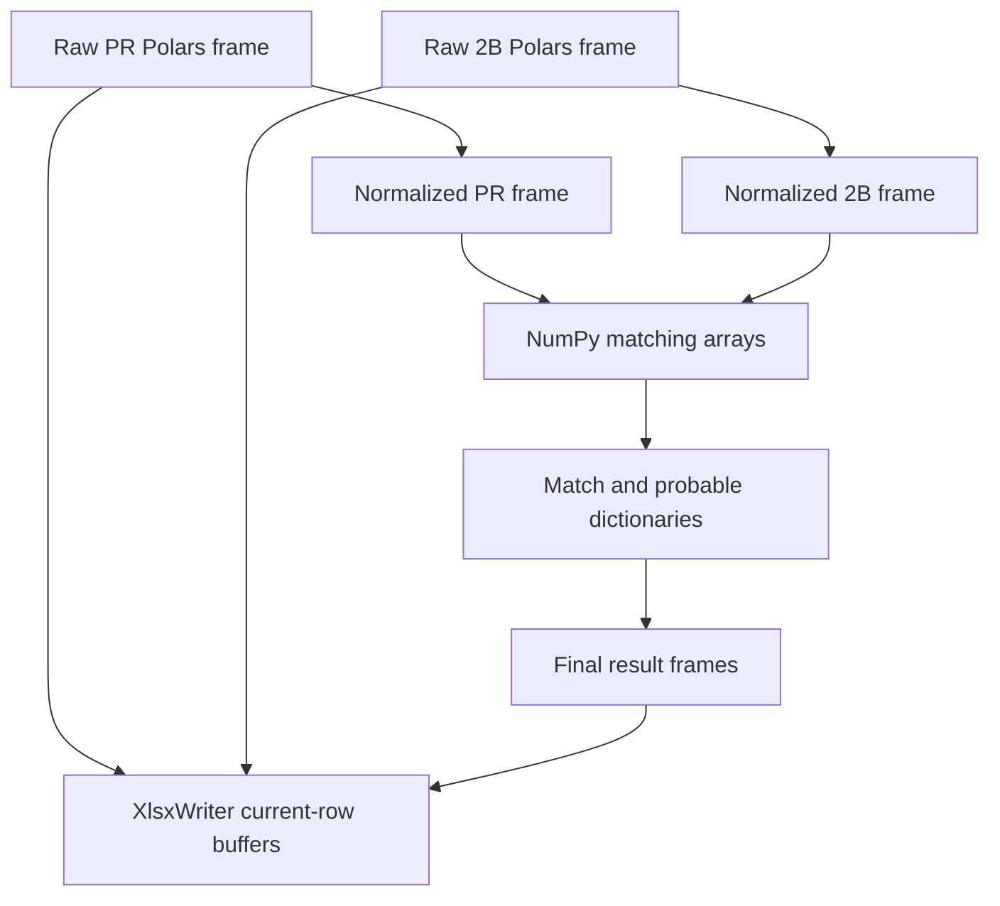

# GST Reconciliation System Architecture

## 1. Purpose

This application reconciles a Purchase Register against GSTR-2B data.

It accepts CSV or XLSX files, lets the user confirm how uploaded columns map to
the reconciliation schema, normalizes both registers, creates deterministic
one-to-one matches, records probable matches, and produces:

1. Browser-readable reconciled results.
2. A formatted nine-sheet Excel workbook.

The system is optimized for registers containing up to approximately 100,000
rows each. The current Flask upload limit is 20 MB per request.

The core runtime stack is:

| Responsibility | Technology |
|---|---|
| HTTP and HTML rendering | Flask |
| CSV processing | Polars |
| XLSX input | Polars with fastexcel/calamine |
| Vectorized candidate filtering | NumPy |
| Fuzzy string scoring | RapidFuzz |
| XLSX output | XlsxWriter |
| UI result persistence | JSON files |
| Automated tests | `unittest`, Flask test client, fastexcel |

Pandas, openpyxl, DuckDB, and a database server are not used.

---

## 2. System Context



The Flask process performs the entire reconciliation synchronously during the
`POST /reconcile` request. There is currently no task queue, worker service, or
job-status polling API.

---

## 3. Repository Components

### `app.py`

Owns:

- Flask application creation.
- Upload validation.
- Column-preview routes.
- Mapping JSON parsing.
- Date-tolerance parsing.
- Job-directory creation.
- Result JSON serialization.
- Result pagination and display formatting.
- Workbook download.
- Cleanup after failed reconciliation.

### `reconciliation.py`

Owns:

- CSV and XLSX ingestion.
- Header suggestions.
- Confirmed column mapping.
- Removal of formula-only spreadsheet tail rows.
- Field normalization.
- Reconciliation validation.
- Exact matching.
- Date-only matching.
- Fuzzy matching.
- Probable-match construction.
- Final result-frame construction.
- Stage timing logs.

### `workbook_export.py`

Owns:

- The nine-sheet workbook contract.
- Constant-memory XLSX generation.
- Workbook formats.
- Raw, matched, unmatched, probable, date-only, and result sheets.
- Date and amount conversion for Excel.
- Formula-injection prevention.
- Column width sampling.
- Excel row-limit enforcement.

### `templates/` and `static/`

Own:

- Upload controls.
- Browser-side column mapping.
- Date-tolerance control.
- Result tables.
- Result pagination links.
- Workbook download link.
- Visual styling.

### `tests/`

Owns:

- Unit-level normalization and mapping tests.
- Matching behavior tests.
- Flask route tests.
- XLSX structure and style tests.
- Real-file end-to-end testing using `sample_test_files/input1.xlsx` and
  `sample_test_files/input2.xlsx`.

### `benchmarks/benchmark_reconciliation.py`

Generates repeatable 10,000-row and 100,000-row workloads and reports:

- Reconciliation time.
- Workbook generation time when requested.
- Workbook size.
- Peak resident memory.

---

## 4. Canonical Data Schema

Every source file is mapped into these preferred columns:

| Column | Required | Normalized representation |
|---|---:|---|
| Supplier Name | Yes | Lowercase normalized string |
| GSTIN | Yes for matching, but invalid rows are retained | Canonical 15-character GSTIN or null |
| Invoice No | Yes | Lowercase normalized identifier |
| Invoice Date | Yes | `YYYYMMDD` integer |
| HSN Code (optional) | No | Normalized identifier string |
| Taxable Value | Yes | `Float64` |
| IGST | No | `Float64` |
| CGST | No | `Float64` |
| SGST | No | `Float64` |
| Total GST | No | `Float64` |

The internal normalized frame temporarily also contains:

| Internal column | Purpose |
|---|---|
| `_row_index` | Stable zero-based source-row identity |
| `_GSTIN Issue` | Missing or invalid GSTIN classification |
| `_Original GSTIN` | Original pre-normalization GSTIN value |

Internal columns are removed before results are shown or exported as normalized
tables.

---

## 5. End-to-End Request Lifecycle



---

## 6. Column Preview and Mapping

### 6.1 Preview request

The browser sends one selected file to:

```text
POST /columns
multipart field: file
```

### 6.2 Upload validation

The backend requires:

- A non-empty filename.
- A `.csv` or `.xlsx` extension.

The extension check is not intended to prove that the file contents are valid.
The reader still parses the file and returns a controlled error if it is corrupt.

### 6.3 CSV header reading

Polars reads zero data rows and returns only the source column names.

### 6.4 XLSX header reading

Werkzeug supplies uploads as a `FileStorage` stream. fastexcel does not accept
that stream type directly, so the preview path:

1. Records the current stream position.
2. Reads the uploaded XLSX into bytes.
3. Passes the bytes to `pl.read_excel(..., engine="calamine")`.
4. Reads zero data rows.
5. Restores the stream position in a `finally` block.

This prevents the “source must be a string or bytes” preview failure.

### 6.5 Mapping suggestions

Each preferred column is compared against the unused source-column names.

The normalization applied to headers:

1. Converts to lowercase.
2. Strips surrounding whitespace.
3. Replaces underscores and hyphens with spaces.
4. Removes periods.

RapidFuzz `token_set_ratio` scores each candidate. A suggestion is automatically
selected at a score of 95 or higher.

A source column is never automatically assigned to more than one preferred
field.

### 6.6 Browser mapping state

The browser renders:

- One select input for each normal field.
- A multi-select checkbox group for Taxable Value.
- Required/optional badges.
- Auto-matched confidence badges.
- Validation errors for required fields.

The confirmed mapping is serialized into hidden JSON form inputs:

```json
{
  "Supplier Name": "Supplier Name",
  "GSTIN": "GSTIN",
  "Invoice No": "Invoice No",
  "Invoice Date": "Invoice Date",
  "HSN Code (optional)": "HSN Code",
  "Taxable Value": ["Taxable Base", "Taxable Adjustment"]
}
```

Taxable Value is the only preferred field allowed to use multiple source
columns. Those columns are added row by row.

---

## 7. Upload Persistence and Job Layout

Each reconciliation receives a random 32-character lowercase hexadecimal job
identifier.

```text
instance/
└── jobs/
    └── <job-id>/
        ├── pr_input.csv or pr_input.xlsx
        ├── gstr2b_input.csv or gstr2b_input.xlsx
        ├── pr_result.json
        ├── gstr2b_result.json
        └── gst_reconciliation_report.xlsx
```

Security checks for result and export routes:

- The job ID must contain exactly 32 lowercase hexadecimal characters.
- The resolved job directory must exist.
- The requested output file must exist.

If reconciliation fails after the job directory is created, the application
removes files from that job directory and then removes the directory.

There is currently no scheduled expiry or automatic cleanup for successful jobs.

---

## 8. Input Ingestion

### 8.1 CSV

CSV is read by Polars.

For raw-value preservation:

- Schema inference is disabled.
- Values are retained as strings where possible.
- Automatic date parsing is disabled.
- Empty values are not automatically converted using pandas-style NA rules.

This preserves identifiers such as:

```text
Invoice No: 000123
HSN:        0012
```

### 8.2 XLSX

XLSX is read through:

```python
pl.read_excel(path, engine="calamine")
```

fastexcel/calamine converts the workbook into a Polars frame.

### 8.3 Formula-only and formatted tail rows

Real accounting workbooks often contain formulas, styles, or helper columns
filled far below the actual transaction rows.

The uploaded test files demonstrate this:

| File | XLSX reader height | Actual mapped business rows |
|---|---:|---:|
| `input1.xlsx` | 1,000 | 558 |
| `input2.xlsx` | 1,000 | 579 |

The system derives the source columns selected by the confirmed mapping, or by
automatic suggestions when no confirmed mapping exists.

A row is retained only when at least one mapped reconciliation field contains a
non-null, non-blank value.

This filtering happens before normalization so:

- Empty spreadsheet tails do not become missing-GSTIN records.
- Matching performs less work.
- Raw and normalized row indexes stay aligned.
- Workbook sheets do not contain hundreds of fake blank records.

---

## 9. Mapping Validation

Confirmed mappings are strict.

The backend rejects a mapping when:

- It names an unknown preferred field.
- It references a source column that does not exist.
- A source column is assigned to multiple preferred fields.
- A required preferred field is not mapped.
- A list is supplied for a field other than Taxable Value.
- Taxable Value contains duplicate source columns.
- A selected Taxable Value source contains non-numeric non-blank data.

Unmapped optional preferred columns are created as null columns.

When no confirmed mapping is supplied, the backend falls back to automatic
header suggestions.

---

## 10. Normalization Pipeline



### 10.1 Supplier Name

The supplier name is:

1. Cast to string.
2. Trimmed.
3. Converted to lowercase.
4. Reduced to single spaces between words.
5. Converted to null if empty.

Example:

```text
"  ACME   SUPPLIERS Pvt Ltd " → "acme suppliers pvt ltd"
```

### 10.2 GSTIN

GSTIN normalization:

1. Treats null and blank input as `Missing GSTIN`.
2. Applies Unicode NFKC normalization.
3. Converts to uppercase.
4. Removes zero-width characters.
5. Removes non-alphanumeric characters.
6. Searches for structurally valid GSTIN tokens.
7. Accepts the value only when exactly one valid token is present.

Examples:

```text
"27-ADZFS-0848J1Z8"      → "27ADZFS0848J1Z8"
"27ADZFS0848J1Z8_X000D_" → "27ADZFS0848J1Z8"
blank                     → Missing GSTIN
"GST: NOT-VALID"          → Invalid GSTIN
two valid GSTINs          → Invalid GSTIN
```

Missing and invalid GSTIN rows remain in results and in the dedicated workbook
review sheet, but they are excluded from matching.

### 10.3 Invoice Number

Invoice numbers are:

1. Cast to string.
2. Trimmed.
3. Stripped of a trailing decimal representation such as `.0`.
4. Converted to lowercase.
5. Converted to null if empty.

```text
"000123" → "000123"
"1001.0" → "1001"
" AB-1 " → "ab-1"
```

### 10.4 HSN Code

HSN uses the same identifier cleanup without lowercasing.

### 10.5 Monetary fields

The common-path Polars expression:

1. Casts to string.
2. Trims whitespace.
3. Removes non-breaking spaces.
4. Removes commas, currency symbols, and internal whitespace.
5. Converts parenthesized values to negative values.
6. Converts trailing minus signs to leading minus signs.
7. Casts to `Float64` without raising on invalid text.

Examples:

```text
"₹ 1,250.00" → 1250.0
"(500.00)"    → -500.0
"500-"        → -500.0
```

### 10.6 Dates

Dates are normalized to an integer:

```text
YYYYMMDD
```

Supported forms include:

- `DD/MM/YYYY`
- `DD-MM-YYYY`
- `DD.MM.YYYY`
- `DD Mon YYYY`
- `DD Month YYYY`
- `YYYY-MM-DD`
- `YYYY/MM/DD`
- `YYYY.MM.DD`
- `YYYYMMDD`
- Excel serial dates
- Native Python date/datetime values

Example:

```text
01/06/2026 → 20260601
```

### 10.7 Validation

The upload is rejected when every row is unusable for one of these required
fields:

- Supplier Name
- Invoice No
- Invoice Date
- Taxable Value

GSTIN is deliberately not included in this rejection rule because missing and
invalid GSTIN rows must remain available for review.

---

## 11. Reconciliation Report Contract

`ReconciliationReport` contains:

```text
Raw Purchase Register frame
Raw GSTR-2B frame
Normalized/classified Purchase Register result
Normalized/classified GSTR-2B result
Matched pairs
Date-only pairs
GSTIN issue dictionaries
Original GSTIN dictionaries
Unmatched row indexes
Best probable matches in both directions
```

A `MatchPair` contains:

```text
Purchase Register row index
GSTR-2B row index
Match score
```

The index is always the stable zero-based row position after empty business rows
have been removed.

---

## 12. Matching Pipeline



Rows are matched in three passes. A row reserved by an earlier pass cannot be
used by a later pass.

### Match categories

Each final row receives exactly one category:

- `Matched`
- `Date only`
- `Unmatched`
- `Missing GSTIN`
- `Invalid GSTIN`

---

## 13. Pass One: Full Exact Matching

### 13.1 Exact key

The exact key uses every preferred field:

```text
Supplier Name
GSTIN
Invoice No
Invoice Date
HSN Code (optional)
Taxable Value
IGST
CGST
SGST
Total GST
```

### 13.2 Duplicate handling

GSTR-2B indexes are stored in ordered queues by exact key.

Purchase Register rows are processed in source order. Each PR row consumes the
lowest still-available GSTR-2B index from its key queue.

Example:

```text
PR duplicate occurrence 1 → 2B duplicate occurrence 1
PR duplicate occurrence 2 → 2B duplicate occurrence 2
```

This creates deterministic one-to-one duplicate pairing.

### 13.3 Exact score

Every full exact pair receives:

```text
Best score = 100.0
Match category = Matched
```

---

## 14. Pass Two: Date-Only Matching

This pass handles records where every preferred field except Invoice Date is
identical.

It only runs when the configured date tolerance is greater than zero.

For each eligible PR row:

1. Build a key excluding Invoice Date.
2. Find unused GSTR-2B rows with the same key.
3. Calculate the absolute date difference.
4. Require a difference greater than zero.
5. Require the difference to be within the configured tolerance.
6. Select the smallest date difference.
7. Break equal differences using the lowest GSTR-2B index.
8. Reserve the selected GSTR-2B row.

Date-only pairs receive:

```text
Best score = 100.0
Match category = Date only
```

The workbook displays the actual difference in days instead of the score.

---

## 15. NumPy Matching Context

After exact and date-only reservations, the remaining fuzzy work uses compact
arrays.

For each side the context contains:

| Array | Type/purpose |
|---|---|
| Supplier names | Object/string scoring values |
| GSTINs | Object/string grouping values |
| Invoice numbers | Object/string scoring values |
| Invoice dates | `int32` ordinal dates |
| Taxable values | `float64` |
| Availability | Boolean reservation mask |

GSTR-2B indexes are grouped once by GSTIN:

```text
GSTIN → NumPy array of candidate row indexes
```

This prevents scanning unrelated GSTINs during fuzzy matching.

---

## 16. Pass Three: Fuzzy Matching

Fuzzy allocation intentionally remains deterministic and greedy.

Purchase Register rows are processed in ascending original order.

### 16.1 Candidate filtering

For a PR row, candidates must:

1. Have the same normalized GSTIN.
2. Still be available.
3. Have a usable invoice date.
4. Be within the allowed date difference.
5. Have a usable taxable value.
6. Be within the taxable-value tolerance.

The allowed taxable-value difference is:

```text
numeric_tolerance × max(abs(PR taxable value), 1.0)
```

With the default `0.01` tolerance, this is approximately one percent.

Date and amount filtering uses NumPy masks over integer candidate indexes.

### 16.2 Fuzzy score

RapidFuzz calculates:

```text
Supplier score = WRatio(PR supplier, 2B supplier)
Invoice score  = WRatio(PR invoice, 2B invoice)

Final score = 0.5 × Supplier score + 0.5 × Invoice score
```

### 16.3 Winner selection

The winner is selected using:

```text
Highest final score
Then lowest GSTR-2B index
```

When the score is at least the match threshold:

1. Create the pair.
2. Mark the PR row matched.
3. Mark the GSTR-2B row unavailable.
4. Continue to the next PR row.

The current report path uses a threshold of 80 for classification.

### 16.4 Why greedy behavior is retained

Greedy PR-order assignment preserves the application’s historical behavior.

A global assignment algorithm could produce more matches overall, but it could
also change which invoices pair together. Financial reconciliation benefits
from reproducibility, so the current behavior favors deterministic compatibility.

---

## 17. Candidate Score Cache

Each PR row’s candidate indexes and fuzzy scores are retained during the primary
fuzzy pass.

Probable-match generation does not repeat the expensive candidate construction
and fuzzy scoring.

After all confirmed matches have reserved their rows:

1. Load the cached candidates for each unmatched PR row.
2. Remove candidates that are no longer unmatched.
3. Keep candidates below the confirmed-match threshold.
4. Sort by descending score and then ascending GSTR-2B index.
5. Store the best candidate as the PR row’s probable match.
6. Reverse the candidate relationships.
7. For each unmatched GSTR-2B row, select the highest-scoring PR row and then the
   lowest PR index.

This produces probable-match information in both directions without recomputing
RapidFuzz scores.

---

## 18. Result Construction

Result columns are first built as Python/typed arrays:

### Purchase Register result fields

```text
Best score
Best match 2B index
Probable 2B indexes
Best probable score
Best probable 2B index
Match category
```

### GSTR-2B result fields

```text
Best score
Best match PR index
Probable PR indexes
Best probable score
Best probable PR index
Match category
```

The matcher fills those arrays while processing match dictionaries. The arrays
are attached to each Polars frame once.

This avoids repeatedly mutating individual DataFrame cells.

---

## 19. Browser Result Persistence

After reconciliation, Flask writes:

```text
pr_result.json
gstr2b_result.json
```

Polars serializes the frames directly. No pandas conversion occurs.

The result route currently:

1. Loads each complete JSON file.
2. Calculates the requested page.
3. Slices ten rows.
4. Formats dates, amounts, and scores for display.
5. Renders HTML.

This behavior is intentionally unchanged in the current architecture.

For substantially larger persistent jobs, JSON pagination would be a future
optimization candidate, but DuckDB/Parquet/database pagination is out of scope
for the current implementation.

---

## 20. Workbook Generation



### 20.1 Workbook options

The workbook is created with:

```python
{
    "constant_memory": True,
    "strings_to_numbers": False,
    "strings_to_formulas": False
}
```

Consequences:

- Rows are flushed sequentially instead of retaining the complete worksheet.
- Numeric-looking identifiers remain strings.
- Uploaded strings beginning with `=` are not converted into executable Excel
  formulas.

### 20.2 Format reuse

Formats are created once per workbook:

- Header.
- Date.
- Amount.
- Score body.
- Score header.
- Date-difference body.
- Blue group heading.
- Gold group heading.
- Green group heading.

Reusing formats avoids creating thousands of duplicate Excel style definitions.

### 20.3 Width calculation

The writer does not scan worksheets after writing.

It:

1. Starts with the header width.
2. Samples at most the first 250 data rows while writing.
3. Tracks the longest displayed value.
4. Clamps the width between 12 and 40.
5. Applies the final width.

### 20.4 Typed output

Before a row is written:

- Date columns are converted to Python date/datetime values.
- Amount columns are converted to numeric values.
- NumPy scalar types are converted to native Python values.
- Lists are rendered as comma-separated text.
- NaN values become blank cells.

Column-level date and amount formats are registered before rows are flushed.

### 20.5 Excel row guard

Excel supports at most:

```text
1,048,576 rows per worksheet
```

Before creating a sheet, the exporter checks:

```text
data rows + header rows <= Excel maximum
```

If not, it raises an explicit error naming the sheet and required row count.

---

## 21. Nine-Sheet Workbook Contract

| # | Sheet | Contents |
|---:|---|---|
| 1 | Purchase Register | Filtered original PR values |
| 2 | GSTR-2B | Filtered original 2B values |
| 3 | Missing & Invalid GSTIN | Source, original index, issue, original GSTIN, and raw row |
| 4 | Matched Entries | PR row, score, and paired 2B row |
| 5 | PR Not in 2B | Unmatched PR row and best probable 2B row |
| 6 | 2B Not in PR | Unmatched 2B row and best probable PR row |
| 7 | Date Only | Paired records and date difference in days |
| 8 | PR Reconciled | Normalized and classified PR result |
| 9 | GSTR-2B Reconciled | Normalized and classified 2B result |

### Simple sheets

Simple sheets contain:

- One header row.
- Auto-filter.
- Frozen first row.
- Date/amount number formats.
- Sampled column widths.

### Grouped sheets

Grouped sheets contain:

- Row 1: merged left and right register headings with a center Match heading.
- Row 2: column headers.
- Row 3 onward: left row, center score/difference, right row.
- Frozen first two rows.
- Auto-filter beginning at row 2.
- Visually emphasized center column.

---

## 22. Error Handling

### Controlled input errors

`ReconciliationInputError` is used for:

- Missing files.
- Unsupported extensions.
- Unreadable files.
- Invalid mappings.
- Missing required fields.
- Invalid taxable-value mappings.

The user receives the specific error with HTTP 400.

### Unexpected errors

Unexpected exceptions:

1. Are logged with a traceback.
2. Trigger cleanup of the partially created job directory.
3. Return a generic reconciliation failure message with HTTP 400.

### Upload too large

Flask returns HTTP 413 with:

```text
Uploads must be 20 MB or smaller.
```

### Missing result/export

Invalid job IDs, missing directories, or missing workbook files return HTTP 404.

---

## 23. Logging and Observability

The reconciliation path logs:

- Purchase Register row count.
- GSTR-2B row count.
- Input read time.
- Normalization time.
- Exact-pair count and time.
- Date-only-pair count and time.
- Fuzzy-pair count and time.
- Total reconciliation time.
- Workbook path.
- Workbook byte size.
- Workbook generation time.

Example:

```text
read inputs: pr_rows=558 gstr2b_rows=579 elapsed=0.087s
normalization: elapsed=0.025s
exact matching: pairs=285 elapsed=0.007s
date-only matching: pairs=0 elapsed=0.007s
fuzzy matching: pairs=205 elapsed=0.040s
reconciliation complete: elapsed=0.169s
xlsx export: size=271138 elapsed=0.689s
```

There is no metrics server, tracing backend, or centralized log aggregation in
the current application.

---

## 24. Real Uploaded-File E2E Result

The permanent E2E test uses:

```text
sample_test_files/input1.xlsx
sample_test_files/input2.xlsx
```

It verifies:

1. Both files exist.
2. Purchase Register column preview succeeds.
3. GSTR-2B column preview succeeds.
4. All required fields receive suggestions.
5. `HSN Code` maps to `HSN Code (optional)`.
6. Confirmed mappings are posted with the files.
7. Reconciliation redirects successfully.
8. The result page renders both row counts.
9. Both JSON files contain the expected number of records.
10. Bidirectional match-link columns exist.
11. Workbook download succeeds.
12. The workbook has all nine sheet names.
13. Both raw workbook sheets contain the expected business-row counts.

Observed result:

| Metric | Value |
|---|---:|
| Purchase Register rows | 558 |
| GSTR-2B rows | 579 |
| Exact + fuzzy matched pairs | 490 |
| Date-only pairs | 0 |
| Unmatched PR rows | 46 |
| Unmatched GSTR-2B rows | 89 |
| PR missing GSTIN | 21 |
| PR invalid GSTIN | 1 |
| PR probable matches | 10 |
| GSTR-2B probable matches | 10 |
| Core reconciliation time | approximately 0.13–0.20 seconds |
| Workbook generation time | approximately 0.57–0.69 seconds |
| Workbook size | approximately 271 KB |

---

## 25. Test Architecture



The test suite covers:

- Exact matching.
- Fuzzy matching.
- Date tolerance.
- Taxable-value tolerance.
- Missing and invalid GSTIN.
- GSTIN noise extraction.
- Header variants.
- Confirmed mapping.
- Mapping conflicts.
- Multiple Taxable Value columns.
- Duplicate exact records.
- Deterministic fuzzy tie-breaking.
- CSV input.
- XLSX input.
- XLSX upload-stream preview.
- Flask reconciliation.
- Result pagination.
- JSON output.
- Workbook download.
- Nine sheet names.
- Raw-value preservation.
- Date and amount formats.
- Group headings and emphasized score styles.
- Formula-safe string writing.
- Actual uploaded workbook flow.

Current status:

```text
43 tests passing
```

Run:

```powershell
.\venv\Scripts\python.exe -m unittest discover -s tests
```

Run only the uploaded-file E2E test:

```powershell
.\venv\Scripts\python.exe -m unittest tests.test_uploaded_files_e2e -v
```

---

## 26. Performance Model

### Ingestion

- CSV parsing is columnar and parallelized by Polars.
- XLSX parsing is constrained by the XLSX format and calamine reader.

### Normalization

- Most string and numeric cleanup uses Polars expressions.
- GSTIN and flexible date handling retain specialized Python logic for
  correctness on irregular accounting exports.

### Exact matching

- Approximately linear in the number of eligible rows.
- Memory grows with unique exact keys and duplicate queues.

### Date-only matching

- Approximately linear for key construction.
- Candidate selection cost depends on duplicate density per non-date key.

### Fuzzy matching

The primary cost depends on candidate-group density:

```text
PR rows × candidates sharing GSTIN after date/amount filtering
```

The same-GSTIN grouping and NumPy date/amount filters prevent a full Cartesian
comparison between both registers.

### XLSX output

Even with constant-memory writing, XLSX output is CPU-intensive because the
system intentionally writes overlapping data into nine formatted worksheets.

Measured generated workloads on the development machine:

| Workload | Result |
|---|---|
| 10,000 exact rows per register | approximately 0.68 seconds reconciliation |
| 10,000-row nine-sheet export | approximately 8 seconds |
| 100,000 exact rows per register | approximately 4.78 seconds reconciliation |
| 100,000-row peak RSS | approximately 402 MB |

Measurements vary by CPU, storage, Python build, and file contents.

---

## 27. Memory Ownership

During reconciliation, the main live objects are:



Important memory decisions:

- Spreadsheet tail rows are removed early.
- Row availability uses boolean NumPy arrays.
- Date arrays use `int32`.
- Candidate indexes use compact integer arrays.
- Results are attached to Polars frames once.
- XlsxWriter uses constant-memory mode.
- Workbook row lookups do not pre-create complete lists of raw row tuples.
- Width calculation stores only one integer per output column.

The application still intentionally retains raw and normalized result frames
simultaneously because both are required by the nine-sheet report.

---

## 28. Determinism and Financial Safety

The following rules ensure reproducible results:

- Stable zero-based input indexes.
- Exact duplicates paired in occurrence order.
- Date-only ties resolved by the lowest 2B index.
- Fuzzy PR rows processed in source order.
- Fuzzy score ties resolved by the lowest available 2B index.
- Probable candidates sorted by score and then index.
- Missing/invalid GSTIN rows never enter matching.
- Uploaded strings beginning with `=` remain text in Excel.
- Confirmed mappings are validated strictly.

Given identical files, mappings, tolerances, and library versions, pair
selection is expected to remain identical.

---

## 29. Deployment Shape

The development server can run with:

```powershell
flask --app app run --debug
```

The repository also provides a Gunicorn process declaration for Linux/macOS
deployment.

Because jobs run synchronously:

- A request worker remains occupied during reconciliation and export.
- Multiple Gunicorn workers allow multiple independent jobs.
- Each concurrent job has its own memory footprint.
- Worker count must be sized against available RAM, not CPU count alone.

For example, if a large job uses approximately 400 MB peak RSS, four concurrent
workers may require substantially more than 1.6 GB once interpreter and server
overhead are included.

---

## 30. Known Boundaries and Future Options

### Current boundaries

- Synchronous reconciliation.
- Local filesystem job storage.
- Full JSON result documents loaded before pagination.
- No successful-job expiry.
- No authentication or per-user job ownership.
- One-process memory contains raw and result frames.
- Excel worksheet row limit.
- Fuzzy allocation is greedy, not globally optimal.

### Reasonable future improvements

These are not part of the current implementation:

1. Background job workers for long-running reconciliations.
2. Job progress and cancellation.
3. Parquet result persistence.
4. DuckDB or database-backed page queries.
5. Automatic job retention and cleanup.
6. Authentication and access control.
7. Per-job metrics and structured tracing.
8. Configurable score weights and thresholds.
9. A review/approval workflow for probable matches.
10. Optional global assignment matching for users who prefer maximum total
    match quality over historical greedy behavior.

---

## 31. Compact Operational Checklist

### Start the application

```powershell
.\venv\Scripts\Activate.ps1
pip install -r requirements.txt
flask --app app run --debug
```

### Verify correctness

```powershell
.\venv\Scripts\python.exe -m unittest discover -s tests
```

### Verify real uploaded files

```powershell
.\venv\Scripts\python.exe -m unittest tests.test_uploaded_files_e2e -v
```

### Run a 10,000-row benchmark with XLSX generation

```powershell
.\venv\Scripts\python.exe benchmarks\benchmark_reconciliation.py `
  --rows 10000 `
  --workload exact `
  --export
```

### Run a 100,000-row reconciliation benchmark

```powershell
.\venv\Scripts\python.exe benchmarks\benchmark_reconciliation.py `
  --rows 100000 `
  --workload exact
```

---

## 32. Summary

The architecture separates the system into four clear stages:

```text
Upload and confirmed mapping
    ↓
Polars/fastexcel ingestion and normalization
    ↓
Deterministic exact/date/fuzzy one-to-one matching
    ↓
JSON browser results and streaming nine-sheet XLSX output
```

Polars handles columnar data preparation, NumPy minimizes candidate-filtering
overhead, RapidFuzz performs the unavoidable approximate string comparisons,
and XlsxWriter produces the final workbook without constructing a complete
in-memory Excel object graph.

The result is a reproducible financial reconciliation pipeline that preserves
raw evidence, classifies data-quality issues, avoids repeated fuzzy work, and
remains practical for the current 100,000-row design target.
